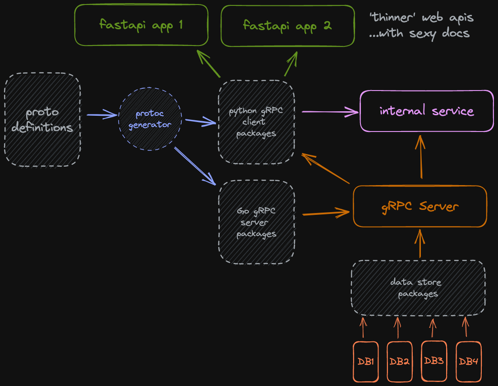

# Mono Repo

## Overview

An experimental mono repo for a bunch of related services.





## Language-specific set up

### Go

- Setting up to compile protobuf and generate gRPC code 

### Python

- [gRPC](./py/README.md#generating-grpc-code) 


See <https://grpc.io/docs/languages/go/quickstart/>

- Install `protoc` (protocol buffer compiler)

Mac OS X

```shell
brew install protobuf 
```

Linux

```shell

```

- Install Go plugins

```shell
go install google.golang.org/protobuf/cmd/protoc-gen-go@latest
go install google.golang.org/grpc/cmd/protoc-gen-go-grpc@latest
```

- Ensure go path 

```shell
export PATH="$PATH:$(go env GOPATH)/bin"
```

## Configuration

Required env vars:

```shell
MONO_MYSQL_DSN
```

## Makefiles

Each package or module, that can be individually tested or built, should have its own `makefile`.

In the root of each language dir there is a language `makefile` that can trigger processes for projects within that 
language dir.

At the project root there is a master `makefile` which can run all the things. 

### Generate gRPC code

```shell
make pb
```


## Style Guides

- [Protocol Buffers Files](https://developers.google.com/protocol-buffers/docs/style)


## Testing with `grpcurl`

- If server supports reflection, can list services:

```shell
grpcurl --plaintext localhost:50051 list

attribute.AttributeService
grpc.reflection.v1alpha.ServerReflection
status.StatusService
```

- Example gRPC request:

```shell
grpcurl --plaintext localhost:50051 status.StatusService/FetchStatus

{
  "healthy": true
}
```
